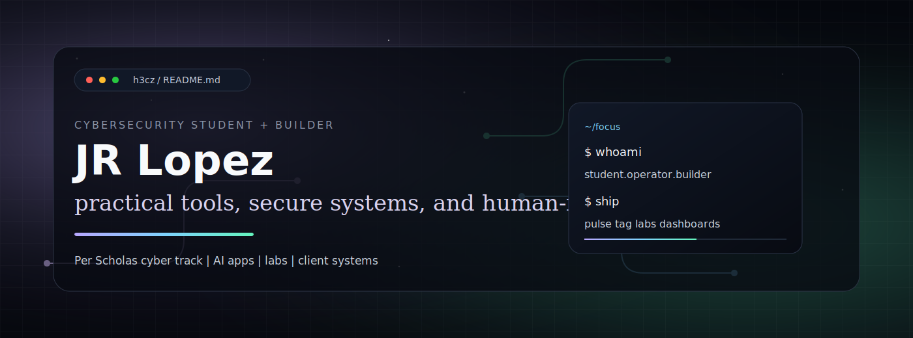

<p align="center">
  
</p>

<p align="center">
  <a href="https://h3cz.github.io"></a>
  <a href="https://hecz.dev"></a>
  <a href="https://pulse-public.vercel.app"></a>
  <a href="https://github.com/h3cz/cybersecurity-labs"></a>
</p>

## Hey, I'm JR

I'm a cybersecurity student at Per Scholas, moving from client operations, sales leadership, and support into secure systems, automation, and practical security tooling.

I like projects that are useful first: tools I can run, inspect, self-host, and explain. My background taught me how to communicate under pressure, document clearly, support real users, and keep work moving when the system is messy. Now I am pairing that with the technical side I have always been drawn to: access, permissions, networks, web apps, and what is happening underneath the interface.

## Featured Projects

| Project | What It Shows | Links |
|---|---|---|
| **Pulse** | Browser focus and sleep audio built with Web Audio, React, TypeScript, PWA support, media controls, and tested EQ/frequency math. | [Repo](https://github.com/h3cz/pulse) · [Live Demo](https://pulse-public.vercel.app) |
| **Tag** | Self-hostable multi-model AI chat with BYOK architecture, Supabase Edge Functions, auth, memory, and public security docs. | [Repo](https://github.com/h3cz/tag) · [Hosted](https://hecz.dev/chat) |
| **Cybersecurity Labs** | School notes, defensive lab writeups, templates, Linux/networking practice, and safe public documentation habits. | [Repo](https://github.com/h3cz/cybersecurity-labs) |
| **Hecz HQ** | Security and workspace dashboard case study in progress: tasks, chat, GitHub activity, integrations, secrets visibility, and ops workflows. | Case study coming next |

## Current Focus

```text
learning:  cybersecurity fundamentals, Linux, networking, web security
building:  secure web apps, client systems, AI tools, defensive dashboards
writing:   lab notes, case studies, field notes from what I ship
```

## Toolkit

<p>
  
  
  
  
  
  
  
  
  
</p>

## Why This Page Exists

I am turning my work into a cleaner public portfolio: focused repos, useful READMEs, live demos, security notes, and projects that show how I think.

The goal is not to look busy. The goal is to make the work easy to inspect.

## Next

- Add real lab writeups to `cybersecurity-labs`
- Add screenshots/GIFs to the older public repos
- Publish the Hecz HQ security/workspace dashboard case study
- Keep building tools that are small enough to understand and real enough to use

## Links

- Site: [hecz.dev](https://hecz.dev)
- GitHub Pages: [h3cz.github.io](https://h3cz.github.io)
- Pulse: [github.com/h3cz/pulse](https://github.com/h3cz/pulse)
- Tag: [github.com/h3cz/tag](https://github.com/h3cz/tag)
- Cybersecurity Labs: [github.com/h3cz/cybersecurity-labs](https://github.com/h3cz/cybersecurity-labs)
